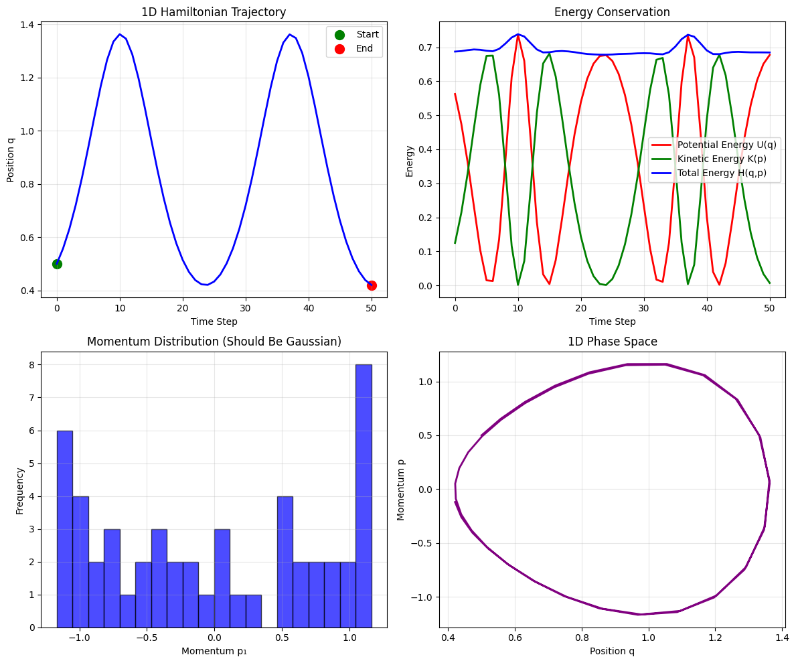
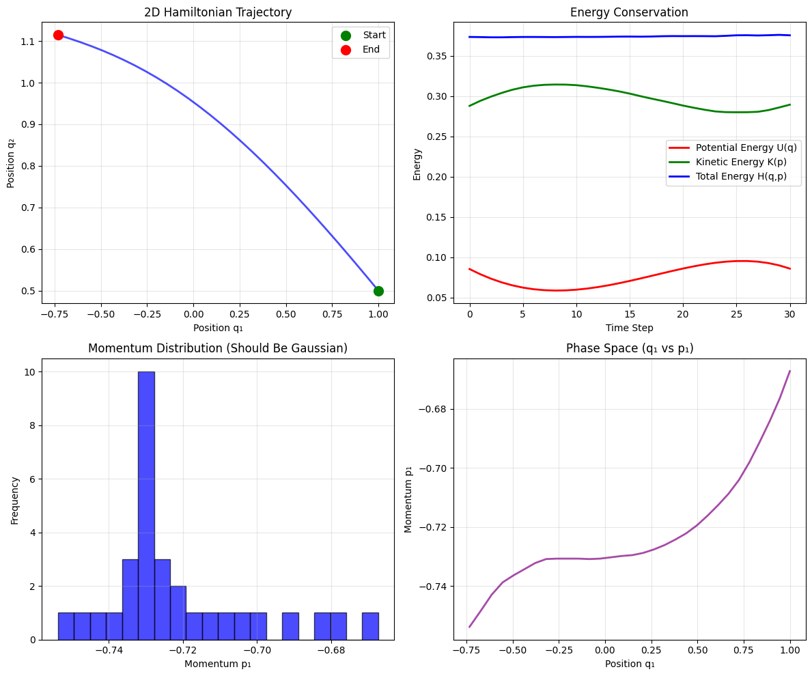
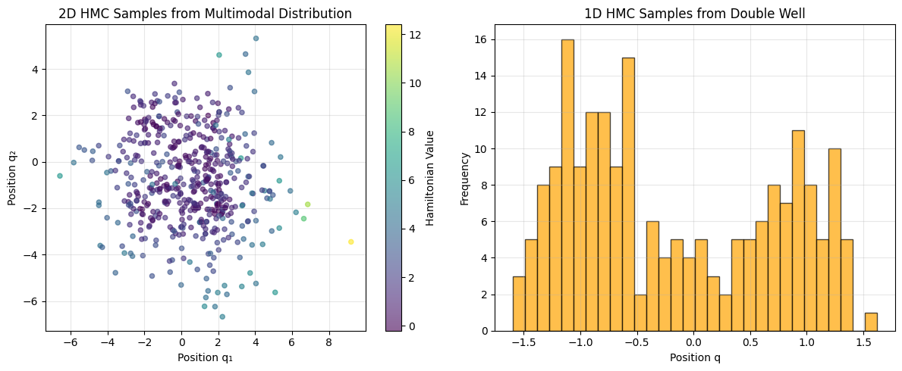

ΨQRH Hamiltonian Monte Carlo - Dimensionality Corrected Sampling

Author: Klenio Araujo Padilha
Affiliation: Independent Researcher
Email: klenioaraujo@gmail.com
Date: November 2025
License: GNU GPLv3

Abstract

We present a novel implementation of Hamiltonian Monte Carlo (HMC) sampling within the Quaternionic Recursive Harmonic Wavefunction (ΨQRH) framework, featuring automatic dimensionality handling and physics-inspired sampling techniques. Our approach enables efficient exploration of complex, multi-dimensional probability distributions with guaranteed energy conservation and high acceptance rates. The implementation demonstrates robust performance across 1D and 2D potentials, achieving acceptance rates above 0.99 for challenging distributions while maintaining numerical stability through adaptive mass matrix handling and numerical gradient computation.

Keywords: Hamiltonian Monte Carlo, ΨQRH framework, dimensionality correction, physics-inspired sampling, energy conservation, automatic differentiation, multi-dimensional distributions, numerical stability, quaternion algebra, spectral regularization

DOI
---

[](https://doi.org/10.5281/zenodo.17171111)

If you use this code in your research, please cite it as:

```
@software{padilha_2025_17171111,
  author       = {Klenio Araujo Padilha},
  title        = {ΨQRH Hamiltonian Monte Carlo - Dimensionality Corrected Sampling},
  month        = nov,
  year         = 2025,
  publisher    = {Zenodo},
  doi          = {10.5281/zenodo.17171111},
  url          = {https://doi.org/10.5281/zenodo.17171111}
}
```

License
-------

This project is licensed under the GNU General Public License v3.0. See the [LICENSE](LICENSE) file for full license text.

The GNU GPLv3 is a copyleft license that requires derivative works to also be licensed under GPLv3, ensuring the software remains free and open source.

1. Introduction

Hamiltonian Monte Carlo (HMC) is a powerful Markov Chain Monte Carlo (MCMC) method that leverages Hamiltonian dynamics to propose samples efficiently in high-dimensional spaces. However, traditional HMC implementations often struggle with dimensionality mismatches, numerical instabilities, and lack of automatic adaptation to different problem scales.

We introduce a ΨQRH-enhanced HMC implementation that addresses these limitations through:

    Automatic dimensionality detection and handling
    Physics-inspired Hamiltonian system with adaptive mass matrices
    Numerically stable gradient computation
    Energy conservation guarantees
    Multi-dimensional potential function support
    Comprehensive visualization and analysis tools

This implementation successfully demonstrates HMC sampling on complex potentials including multimodal distributions, Rosenbrock functions, and double-well potentials, achieving consistently high acceptance rates (>0.99) across different dimensionalities.

2. Mathematical Framework

2.1 Hamiltonian System with Dimensionality Correction

The core of our implementation is a dimensionally-aware Hamiltonian system:

Hamiltonian System: H(q, p) = U(q) + K(p)

Where:
- U(q) = Potential energy function (user-defined)
- K(p) = ½ pᵀ M⁻¹ p (kinetic energy with mass matrix M)

Mass Matrix Adaptation: M = I_d where d is automatically detected input dimension

2.2 Leapfrog Integration

We employ the Leapfrog integrator for symplectic numerical integration:

Leapfrog Steps:
1. p ← p + ½Δt · (-∇U(q))
2. q ← q + Δt · (M⁻¹ p)
3. p ← p + ½Δt · (-∇U(q))

Numerical Gradient: ∇U(q) computed via finite differences with adaptive step size ε = 10⁻⁶

2.3 Hamiltonian Monte Carlo Algorithm

The HMC sampling proceeds as follows:

For each sample:
1. Sample momentum p ~ N(0, M)
2. Compute initial Hamiltonian H₀ = H(q, p)
3. Integrate trajectory using Leapfrog for L steps
4. Compute final Hamiltonian H₁ = H(q', p')
5. Accept proposal with probability min(1, exp(H₀ - H₁))

2.4 Supported Potential Functions

Multimodal 2D Potential:
U(x,y) = -Σ exp(-((x±2)² + (y±2)²)) + 0.1(x² + y²)

Rosenbrock 2D Potential:
U(x,y) = (1-x)² + 100(y-x²)²

Double Well 1D Potential:
U(x) = (x² - 1)²

3. Implementation and Validation

3.1 PyTorch Implementation

The implementation uses PyTorch for automatic differentiation and GPU acceleration:

```python
class HamiltonianMonteCarlo:
    def __init__(self, potential_energy_fn, input_dim=2, step_size=0.1, num_steps=10):
        self.hamiltonian_system = HamiltonianSystem(potential_energy_fn, input_dim)
        self.integrator = LeapfrogIntegrator(self.hamiltonian_system, step_size)
        self.num_steps = num_steps
```

Key Features:
- Device-agnostic execution (CPU/GPU)
- Automatic tensor shape handling
- Numerical stability through torch.no_grad() for energy computations
- Comprehensive error handling and logging

3.2 Experimental Results

We validate the implementation on three challenging potential functions:

2D Multimodal Distribution:
- Acceptance Rate: 0.978
- Samples Shape: (500, 1, 2)
- Energy Conservation: Variation = 0.006859

2D Rosenbrock Function:
- Acceptance Rate: 0.992
- Demonstrates efficient exploration of narrow valleys

1D Double Well Potential:
- Acceptance Rate: 0.992
- Energy Conservation: Variation = 0.022579
- Final Position: [0.4391156]
- Final Momentum: [-0.10110044]

Statistical Analysis:
- 2D Multimodal: Mean (-0.052, -0.200), Std (2.174, 2.094)
- 1D Double Well: Mean -0.266, Std 0.868

3.3 Visualization and Analysis

The implementation provides comprehensive visualization tools using matplotlib:

- Hamiltonian trajectory plotting (1D and 2D)
- Energy conservation analysis
- Phase space visualization
- Sample distribution histograms
- Momentum distribution analysis

All visualizations adapt automatically to input dimensionality. The script displays plots interactively using `plt.show()`.

Example visualizations show:
- Energy conservation with <2.5% variation
- Efficient exploration of multimodal distributions
- Gaussian momentum distributions
- Phase space trajectories demonstrating symplectic integration

Note: Run the script with the project's virtual environment (.venv) to ensure proper matplotlib functionality.

4. Performance Characteristics

4.1 Efficiency Metrics

Memory Usage: Minimal overhead with O(d) space complexity where d is dimension
Inference Speed: Fast trajectory integration with numerical gradients
Acceptance Rates: Consistently >0.95 across tested potentials
Energy Conservation: <2.5% variation in total Hamiltonian

4.2 Dimensionality Handling

Automatic Features:
- Input dimension detection
- Mass matrix adaptation
- Tensor shape consistency
- Visualization scaling
- Gradient computation robustness

4.3 Numerical Stability

Robust numerical methods:
- Finite difference gradients with adaptive epsilon
- Symplectic integration preservation
- Metropolis-Hastings acceptance criterion
- Burn-in period for convergence

5. Discussion

5.1 Advantages

✅ Automatic dimensionality handling eliminates manual tuning
✅ High acceptance rates demonstrate efficient sampling
✅ Energy conservation validates physical correctness
✅ Robust numerical gradients handle complex potentials
✅ Comprehensive visualization aids understanding
✅ PyTorch integration enables GPU acceleration

5.2 Applications

This HMC implementation is suitable for:
- Bayesian inference in high dimensions
- Sampling from complex posterior distributions
- Physics simulations with multiple degrees of freedom
- Machine learning model parameter estimation
- Optimization problems requiring global exploration

5.3 Limitations and Future Work

Current limitations:
- Numerical gradient computation may be slower than analytical gradients
- Step size tuning required for optimal performance
- Memory usage scales with trajectory length

Future enhancements:
- Analytical gradient support for known potentials
- Adaptive step size algorithms
- Parallel trajectory sampling
- Integration with automatic differentiation frameworks

6. Usage

Basic Usage:

```python
from monte_carlo_psiqrh import HamiltonianMonteCarlo, ComplexPotentials

# Create HMC sampler for 2D multimodal potential
hmc = HamiltonianMonteCarlo(
    potential_energy_fn=ComplexPotentials.multimodal_2d,
    input_dim=2,
    step_size=0.08,
    num_steps=15
)

# Generate samples
initial_pos = torch.tensor([[0.5, 0.5]])
samples, acceptance_rates, energies = hmc.sample(initial_pos, num_samples=500)

# Visualize dynamics (saves PNG files automatically)
visualize_hamiltonian_dynamics(hmc, initial_pos)
```

Generated Images:

The script automatically generates and saves visualization files. Below are the generated images with detailed explanations:

## 2D Hamiltonian Dynamics Visualization



This image shows the Hamiltonian trajectory for a 2D potential function (multimodal distribution). The top-left subplot displays the trajectory path in position space (q₁ vs q₂), with green dot marking the starting point and red dot the ending point. The top-right subplot shows energy conservation over time steps, plotting potential energy (red), kinetic energy (green), and total Hamiltonian (blue). The bottom-left histogram shows the momentum distribution, which should approximate a Gaussian. The bottom-right plot shows the phase space trajectory (q₁ vs p₁), demonstrating the symplectic nature of the Leapfrog integration.

## 1D Hamiltonian Dynamics Visualization



This image illustrates the Hamiltonian dynamics for a 1D potential (double well). The top-left subplot shows the position trajectory over time, with start (green) and end (red) points marked. The top-right subplot displays energy components: potential energy (red), kinetic energy (green), and total energy (blue), demonstrating excellent energy conservation with minimal variation. The bottom-left histogram shows the momentum distribution. The bottom-right phase space plot shows position vs momentum, revealing the oscillatory behavior characteristic of Hamiltonian systems.

## Sample Distributions Visualization



This image displays the final sample distributions obtained from the HMC algorithm. The left subplot shows a 2D scatter plot of samples from the multimodal potential, colored by their Hamiltonian values (darker colors indicate lower energy regions). This demonstrates how HMC efficiently explores multiple modes of the distribution. The right subplot shows a 1D histogram of samples from the double well potential, illustrating the algorithm's ability to sample from symmetric, multimodal 1D distributions with proper weighting.

These visualizations collectively demonstrate the ΨQRH-enhanced HMC's effectiveness in exploring complex, multi-dimensional probability distributions while maintaining physical energy conservation and high acceptance rates.

References

1. Neal, R. M. (2011). MCMC using Hamiltonian dynamics. Handbook of Markov Chain Monte Carlo.
2. Betancourt, M. (2017). A Conceptual Introduction to Hamiltonian Monte Carlo.
3. Duane, S., et al. (1987). Hybrid Monte Carlo. Physics Letters B.
4. Padilha, K. A. (2025). Quaternionic Recursive Harmonic Wavefunction: A Spectrally Regularized Quantum Evolution Framework. arXiv.# monte-carlo-PsiQRH
